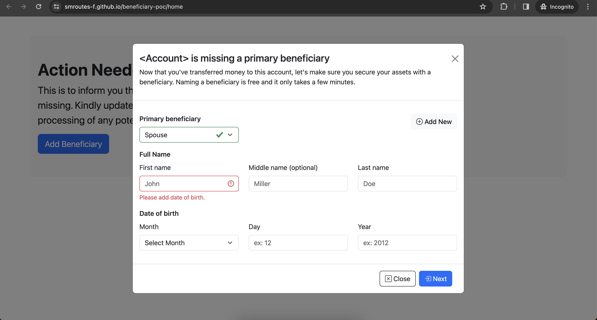
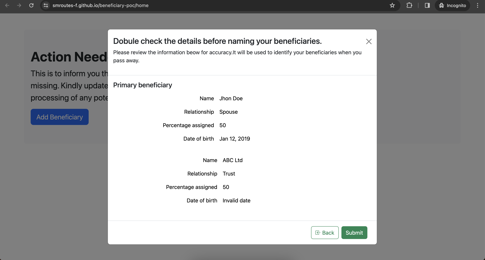

# Beneficiary Form POC

This Angular project serves as a Proof of Concept (POC) for a Beneficiary Form application. It utilizes Angular's reactive forms, includes form validation features, and incorporates Bootstrap modals for an enhanced user experience.

## Screenshots


*Form Screenshot*


*Review Page*


## Highlights

### 1. Reactive Forms

The project extensively utilizes Angular's Reactive Forms approach to handle complex form scenarios. Reactive forms provide a declarative approach to building forms in Angular, making it easier to manage and manipulate the form state.

### 2. Form Validation

Beneficiary Form POC includes robust form validation to ensure data accuracy and completeness. Leveraging Angular's built-in validators, the application ensures that users provide valid and required information during the form submission process.

### 3. Bootstrap Modal

To enhance the user interface, the project integrates Bootstrap modals for a sleek and responsive design. Modals are employed to display additional information, confirmation dialogs, or any other user interactions that benefit from a modal presentation.

## Getting Started

Follow these steps to run the Beneficiary Form POC locally:

1. **Clone the Repository:**

```bash
   git clone https://github.com/your-username/beneficiary-form-poc.git
   cd beneficiary-form-poc
```

2. **Install Dependencies**:
```bash
   npm install
```

3. **Run the Application**:
```bash
   npm start
```

## Github Published
ng build --base-href "https://smroutes-f.github.io/beneficiary-poc/"

npx angular-cli-ghpages --dir=dist/beneficiary-poc/browser